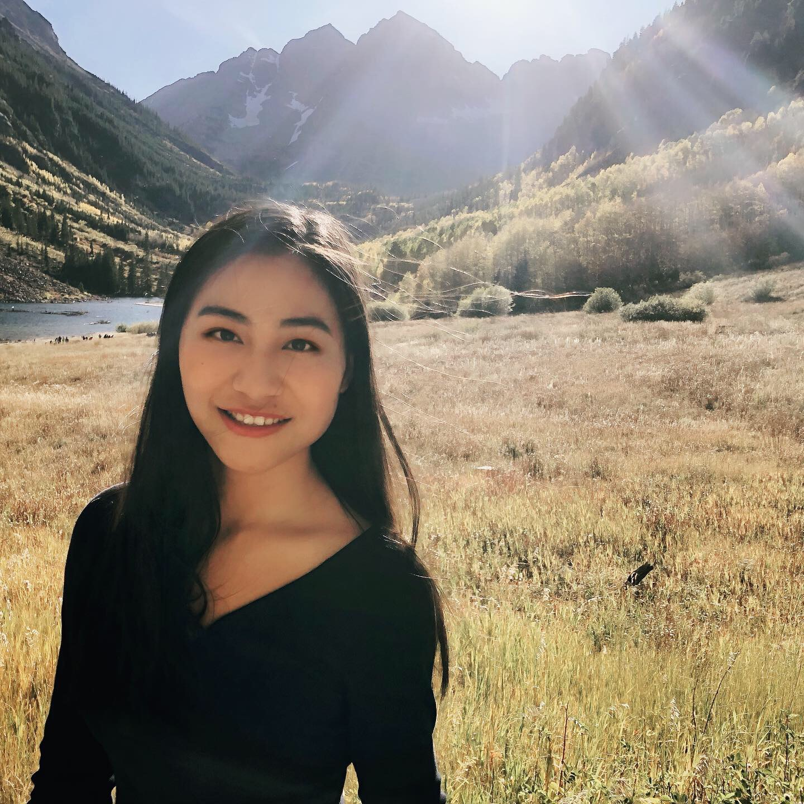

## EDUCATION
09.2015-06.2017: The Southwest University, Chongqing, China
08.2017-12.2019: Colorado State University, Fort Collins, CO, US
09.2020-Now: Columbia University, NY, US

## RESEARCH EXPERIENCE
### Zhihua Liao Lab, College of Biology Science                                        2016-2017
•	My research in Lab is to transfer the H6H genes from kinds of Solannaceae plants（ Anisodus tanguticus, Datura arborea）to Atropa Belladonna, which aim at improving the content of secondary metabolites in Atropa Belladonna. Before I leave the Lab, we have transferred three kinds of H6H genes to Atropa Belladonna respectively. The rest of the research is to let Atropa Belladonna come into many roots. Finally, we will extract alkaloid from the roots and test the content of alkaloid to find out the ideal H6H genes.
•	Prepared and sterilize kinds of reagents, equipment

### Graham Peers Lab, Biology Department, College of Natural Science, Colorado State University, Fort Collins, CO                                               2017-2018
•	Growing wild type and mutation of diatom in 12:12 day and night cycle
•	Cell growth measurements, and BODIPY staining.
•	Photosynthetic performance (Fv/Fm) measurement.
•	Collect and analyze data by excel.
•	General laboratory record keeping. 

## REFERENCES
Graham Peers, Associate Professor 
Department of Biology, Colorado State University (970) 491-6868, graham.peers@colostate.edu

